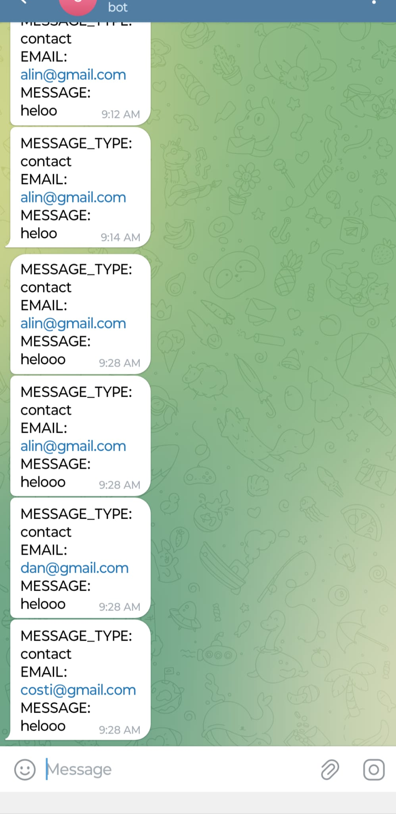

# Push Notifications API (Telegram)

Send from your server to your smartphone notifications using [Telegram Bot API](https://telegram.org/).
Messages are also saved in a sqlite database for later retrival. Useful for getting messages from contact forms from static sites.

<p align="center">
  
</p>


## Quickstart

Search `how to make a telegram bot` and follow the steps to get the following information needed in the `.env` file:

```shell
TELEGRAM_API_TOKEN=BOTTOKEN:FROM:BotFather
CHAT_ID=number-chat-id-after-first-exchange-message
API_KEY=openssl rand -base64 33 | tr '+/' '-_' or something else
PORT=4500 - port on which the GoFiber server will start
```


- download the zip from Releases or build go binary (see Go code); 
- install docker on your VPS or laptop; 
- add your static site(s) or maybe you just use this as an another service; 
- modify Caddyfile domains and links to static sites (see Releases zip file);
- run `docker-compose up -d` to serve static sites in production;


Checkout `static-site\index.html` from this repo to see an example on how you can send a message from a contact form to telegram.

From any static site you just make a fetch post request to `/push-notification-to-telegram` with body:
```json
{
  "messageType": "contact",
  "email": "alin@gmail.com",
  "message": "some message here",
  "timestamp": "",
  "apikey": "YjqkpUhZX9MFxhelTTyzg6cbzN4KYu4pbROsyYP5yc"
}
```

# Why?

Using this API you can keep your Bot Api secrets a bit safer than just making them public in a static site. You can host a ton of static websites on a small 5$ virtual machine. Checkout [bunjucks](https://github.com/ClimenteA/bunjucks) for creating big custom static websites (SSG).